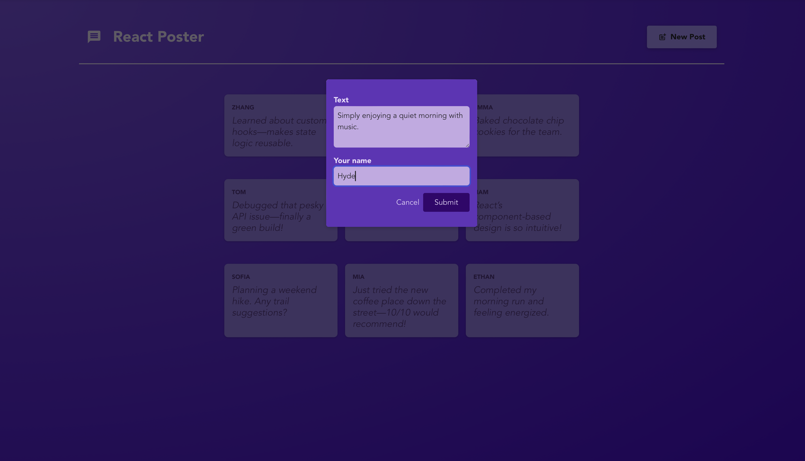
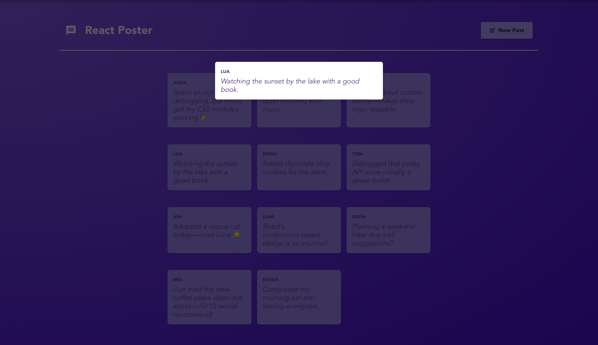

# React Poster Demo 📮

This is a simple React demo application I built as part of a crash course to learn the fundamentals of React, including state, props, components, hooks (`useEffect`), and routing using React Router.

## What is this?

A **single-page application** (SPA) where users can:
- 📝 Create new posts
- 📃 View a list of posts
- 🔍 Click to view detailed content of individual posts

It demonstrates **data loading**, **data submission**, and **page navigation** — all without reloading the page.

## Screenshots

### 1. Empty state
  
The very first view when no posts have been created yet.

---

### 2. New Post modal
  
The form popup where you enter your text and name to create a new post.

---

### 3. Posts list view
  
After adding several entries, the posts appear in a responsive grid.

---

### 4. Post detail overlay
  
Clicking on any post flashes a detail overlay.

---

## 🛠 How to run it

### 1. Clone the frontend repo
```bash
git clone https://github.com/yourusername/react-poster-demo.git
cd react-poster-demo
npm install
npm run dev
```

### 2. Set up the backend

I used a separate dummy backend which handles storing and retrieving posts. It’s available here:
To run it:
```bash
git clone https://github.com/yourusername/react-poster-backend.git
cd react-poster-backend
npm install
npm start
```

This starts the backend at: http://localhost:8080

You should keep both the frontend and the backend running during development.